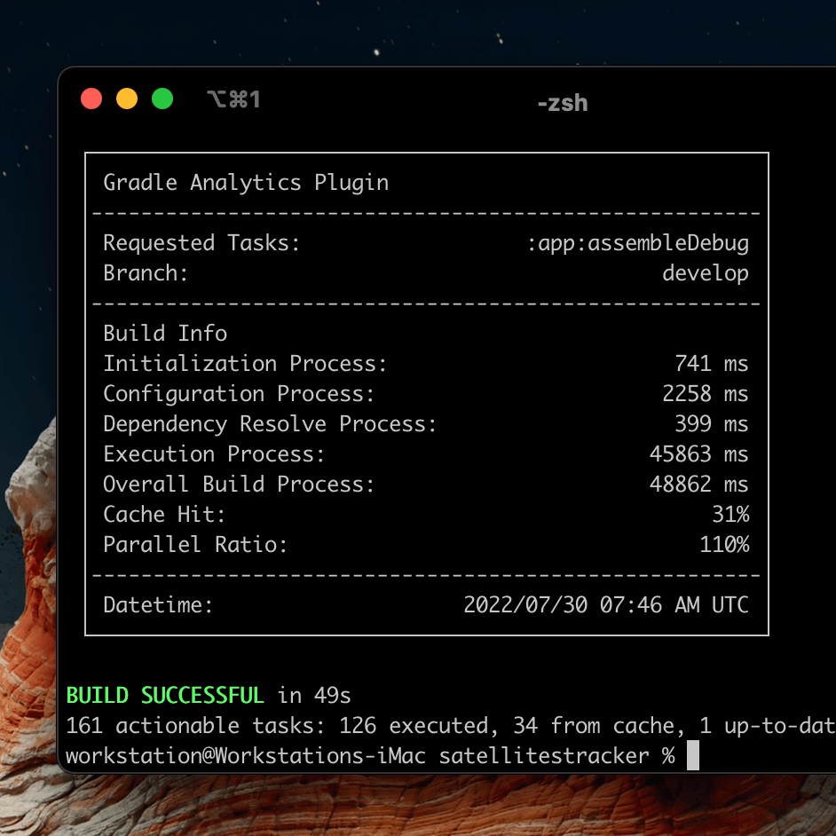

# Gradle Analytics Plugin

<a href="https://github.com/janbarari/gradle-analytics-plugin/issues/new?title=RF:">Request Feature</a> or <a href="https://github.com/janbarari/gradle-analytics-plugin/issues/new?title=RB:">Report Bug</a>
 

A free Gradle plugin for analytics of your projects. Provides unique visual and text metrics in HTML format.

Did you want to see some unique information about your builds in place?

Here is how this plugin gives you this information.

Features
---
- Initialization Process duration [Console, HTML]
- Configuration Process duration [Console, HTML]
- Dependency Resolve duration [Console, HTML]
- Execution Process duration [Console, HTML]
- Overall Build Process duration [Console, HTML]
- Cache Hit [Console, HTML]
- Success Build Rate [HTML]
- Parallel Rate (Tasks are executed in parallel) [Console, HTML]
- Modules source count [HTML]
- Modules source method count [HTML]
- Modules Parallel Rate [In Development...]
- Modules Execution Process [In Development...] 
- Modules Dependency Graph [In Development...]
- Modules Build Size [In Development...]
- Overall Build Weekly/Monthly Velocity Rate [In Development...]
- Execution Process Weekly/Monthly Velocity Rate [In Development...]
- Legacy Resource Count [In Development...]
- Resource Total Size [In Development...]
- System Resource Usage Rate [In Development...]
- etc.

Setup
---
Dependency details will be added after publishing the first beta version

How to use
---
Usage instructions will be added after publishing the first beta version

Release
---
Beta version will be published soon ;D (Waiting for Plugin Portal to review the beta version)

Support
---
Tap on the ⭐ button if you like to support this plugin 🙂.

License
---
Copyright © 2022 [Janbarari](https://github.com/janbarari)  
This project binaries and source code can be used according to the [MIT LICENSE](https://github.com/janbarari/gradle-analytics-plugin/blob/main/LICENSE).
