# Gradle Analytics Plugin

A free Gradle plugin to analyze your project builds. It provides unique visual and text metrics in HTML format.

 
Below you can see the metrics provided by the plugin 👇

!!! Note ""
    
    To understand the metrics and report that plugin provides, It is required to understand Gradle basics and how this build
    system works. <a href="https://docs.gradle.org/current/userguide/what_is_gradle.html" target="_blank">https://docs.gradle.org/current/userguide/what_is_gradle.html</a>

## Build Status
An overview of metrics results of the `requested task` in the build processes over the aforementioned period.

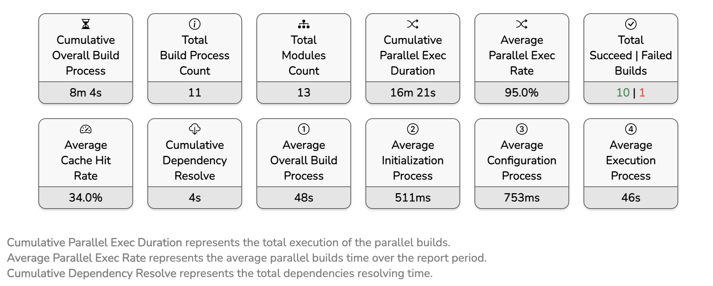

 
## Initialization Process
Gradle supports single and multi-project builds. During the initialization process, Gradle determines which projects are going to take part in the build, and creates a Project instance for each of these projects. By adding more projects or modules the process will take longer.

It denotes the average initialization process time over the report period.

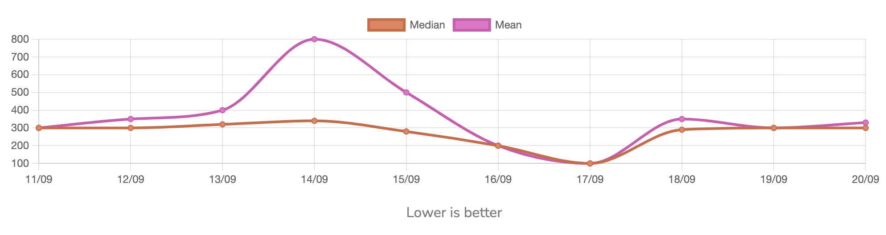

 
## Configuration Process
Constructs and configures the task graph for the build and then determines which tasks need to run and in which order, based on the task the user wants to run. Be careful about the tasks you register to the project and try to make them cacheable.

It shows the average configuration process time over the report period.

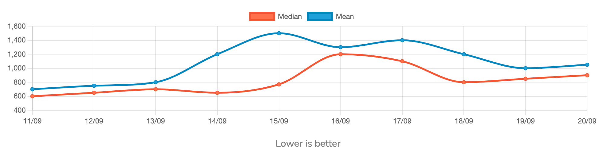

 
## Dependency Resolve Process
Downloading and resolving the project's dependencies is one of the configuration process' stages. If the project has multiple third-party libraries dependencies, make sure that you have a good network speed.

It represents the download(Dependency Resolve) process average duration during the report period.

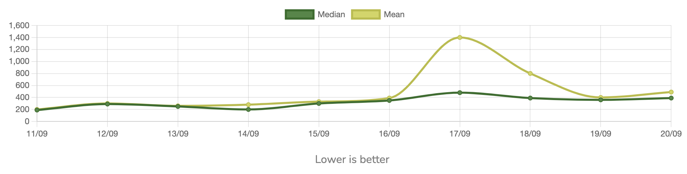

 
## Execution Process
Runs the selected tasks based on `requested tasks` task tree. Gradle executes `requested task` according to the dependency order.

It represents the Execution Process average duration during the report period.

 
## Modules Execution Process
It represents the (Median) process execution time of each module over the report period.

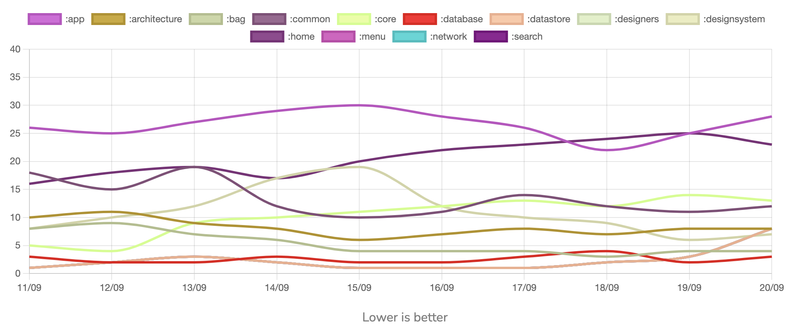
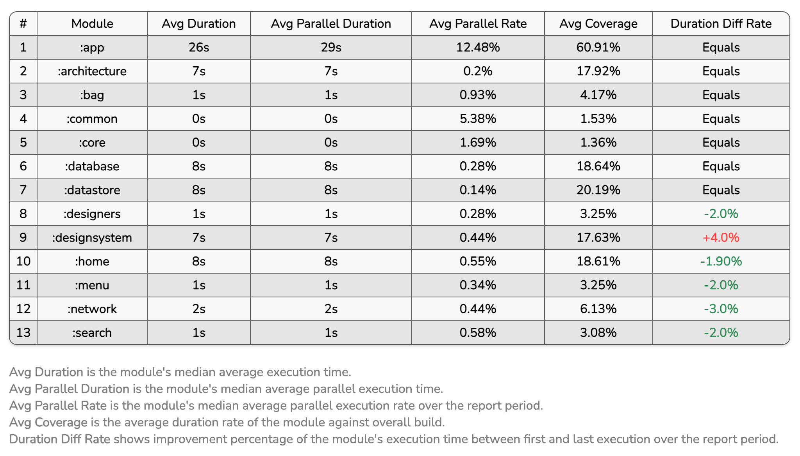

 
## Overall Build Process
It represents the average duration of overall build process.

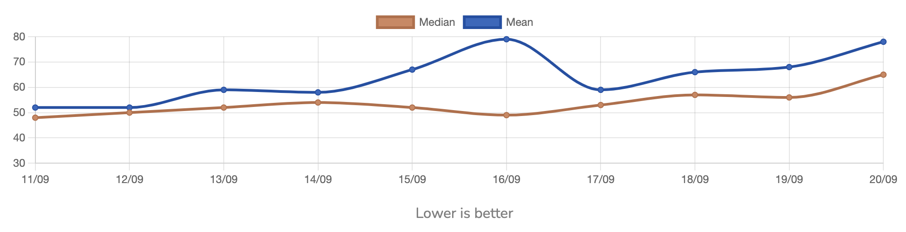

 
## Modules Source Count
It represents the project and its modules source file count. (files with extension of kt, java).

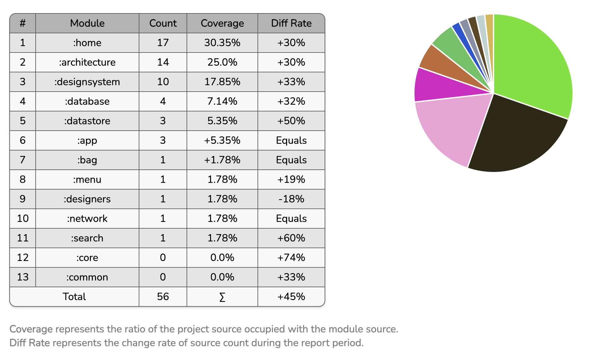

 
## Modules Source Size
It represents the project and its modules source file size.

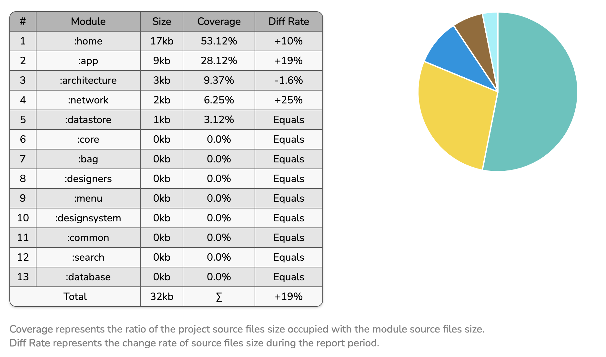

 
## Modules Method Count
It represents the project and its modules source method count.

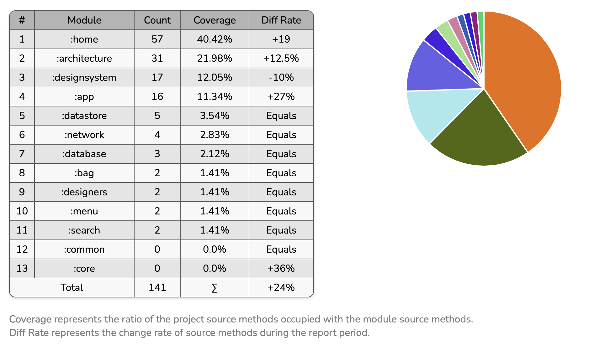

 
## Cache Hit
Gradle creates a cache for the executed task to be reused in the next incremental builds, the more cached tasks lead to faster builds.

It represents the project and modules tasks average cache hit rate (tasks run with FROM_CACHE or UP_TO_DATE).

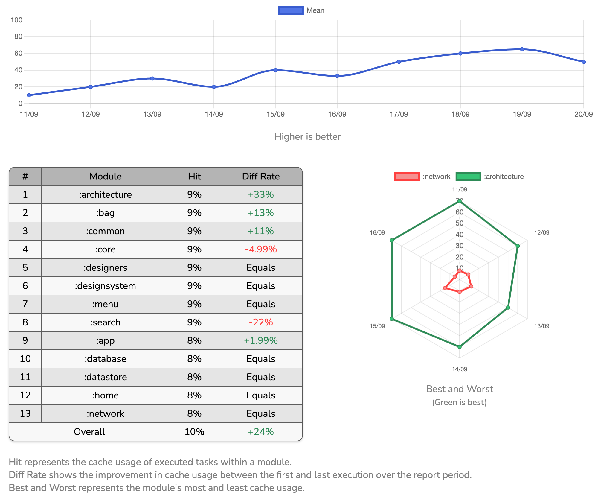

 
## Successful Build Rate
It represents the successful build rate of the `requested task` during the report period.

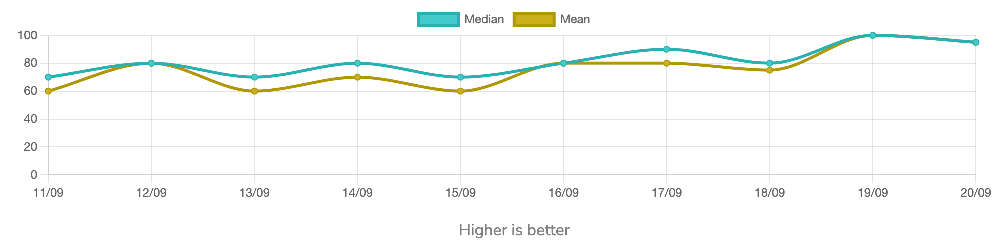

 
## Modules Crash Count
It represents how many build failures happened during the `requested task` execution caused by project modules during the report period.

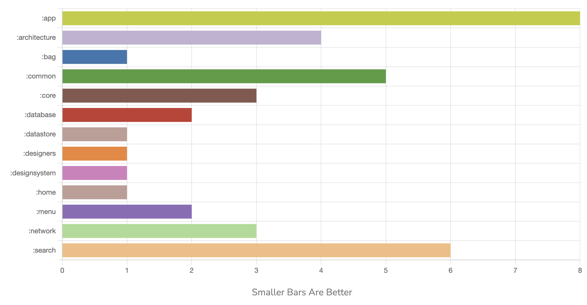

 
## Parallel Execution Rate
Gradle uses CPU cores to execute more tasks simultaneously, leading to a faster build.

It represents a rate that how much time was saved in the execution of the build process with parallel execution versus real elapsed time.

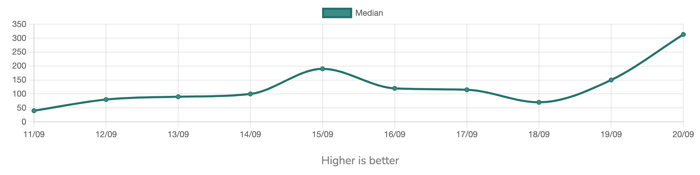

 
## Modules Dependency Graph
It represents the project module's dependency graph and their connection types.

Modules have colors that warm colors have represents more dependent modules, and It is recommended to have fewer warm color modules because by applying any change in these modules, all other dependent modules need to rebuild and this cost more time and resources from your machines and put the builds in queue.

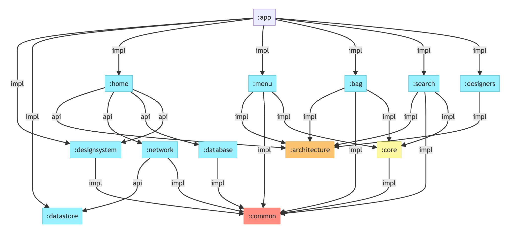

 
## Modules Execution Timeline
It represents the latest modules execution process timeline graph.

 
## Modules Build Heatmap
This plugin uses `Modules Cache Usage` and `Modules Dependency Graph` to generate this metric that shows how many times a module was built during the report period.

Each bar has the name of the module and the number of dependent modules, smaller warm bars lead to faster builds as those modules with warm colors have more dependent modules.

In addition, it helps to modify the modular structure by tracing the graph and finding the cause to avoid rebuilding the modules that are most shared with others.

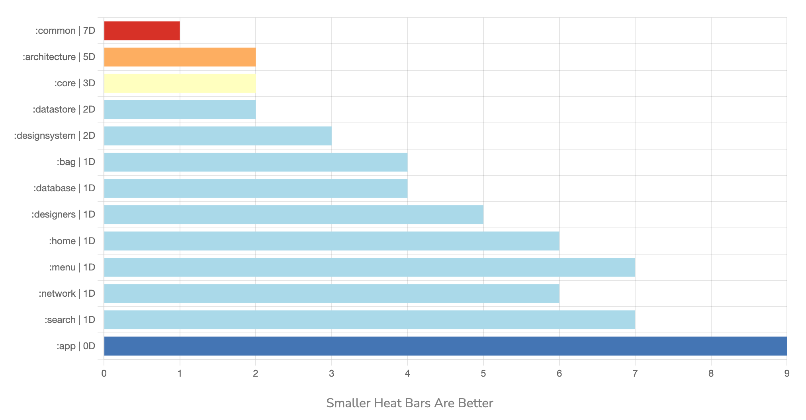

 
## Dependency Details
It represents the project(including all modules) dependencies with their sizes.

 
## Non-cacheable Tasks
These tasks are executed in the `requested task` tree without being cached. Try to avoid creating tasks that are not cacheable. Track this chart and detect tasks that are time-consuming.

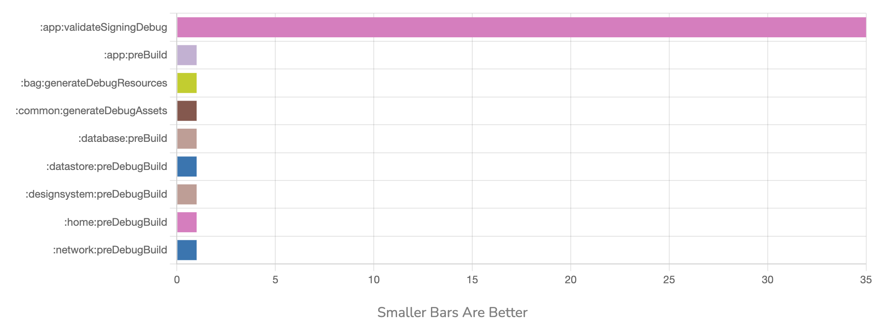

   